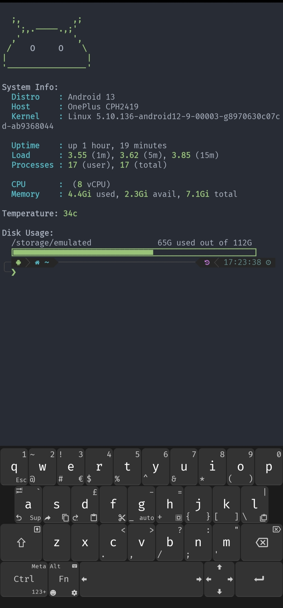
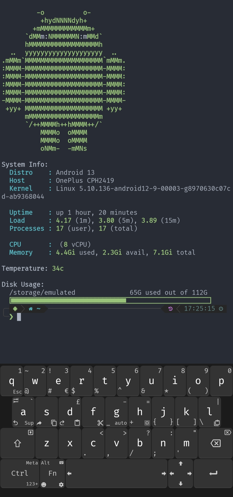
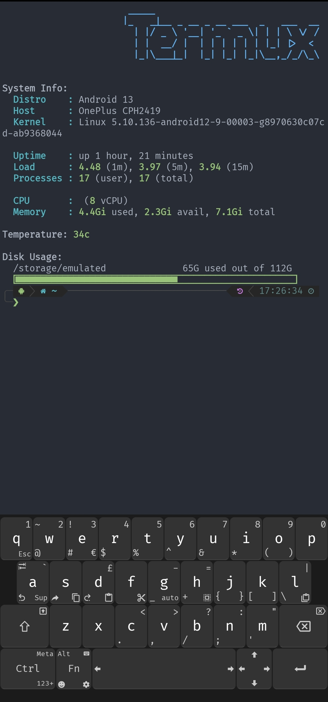

# Message of the Day

A collection of 'Message of the Day' scripts for [Termux](https://termux.com/)
written in rust for raw performance.



<details><summary>More Screenshots</summary>


</details>

### Requirements

* figlet (termux-banner only)
* [FiraCode NerdFont](https://github.com/tonsky/FiraCode) (disk-space progress bar ligatures)
* [Unexpected Keyboard](https://f-droid.org/packages/juloo.keyboard2/) (Keyboard in photos)


## Install
**Automatic**

**⚠️ALWAYS READ SCRIPTS BEFORE RUNNING⚠️**

    curl -fsSL https://raw.githubusercontent.com/GR3YH4TT3R93/rusty-motd/main/install.sh | bash

**Manual**

    rm -rf $PREFIX/etc/motd
    git clone https://github.com/GR3YH4TT3R93/rusty-motd.git $PREFIX/etc/motd
    echo "$PREFIX/etc/motd/init" >> $PREFIX/etc/zprofile # or profile if using bash

## Basic Usage

When installed, rusty-motd will run automatically with default modules (android-logo-small, sysinfo, android-temp, disk-space) every time you start a new shell session.

If you'd like to customize the output refer to the table below or with the following command(s):

```bash
# Display help
$PREFIX/etc/motd/init --help
$PREFIX/etc/motd/init -h
```

## Module Options

| Flag | Module | Description |
|------|--------|-------------|
| `-l` | android-logo-small | Small Android logo |
| `-L` | android-logo | Large Android logo |
| `-b` | termux-banner | Termux banner display |
| `-s` | sysinfo | System information (OS, kernel, etc.) |
| `-u` | uptime | System uptime |
| `-t` | android-temp | Device temperature readings |
| `-d` | disk-space | Disk usage information |

## Customization

To customize which modules are displayed, modify the line in your shell profile:

```bash
# In $PREFIX/etc/zprofile or $PREFIX/etc/profile

# Show only system info and uptime
$PREFIX/etc/motd/init -s -u

# Display large logo with temperature and disk info
$PREFIX/etc/motd/init -L -t -d

# Show everything
$PREFIX/etc/motd/init -l -L -b -s -u -t -d

# Just the Termux banner
$PREFIX/etc/motd/init -b

# Disable MOTD (comment out or remove the line)
# $PREFIX/etc/motd/init
```

## Performance

Rusty MOTD is designed for speed and efficiency. Here are benchmark results comparing it to my optimized shell-based MOTD implementation [termux-motd](https://github.com/GR3YH4TT3R93/termux-motd):

```
Benchmark 1: ./rusty-motd
  Time (mean ± σ):      42.1 ms ±   7.1 ms    [User: 29.4 ms, System: 56.3 ms]
  Range (min … max):    30.7 ms …  65.7 ms    100 runs

Benchmark 2: ../termux-motd/init.sh
  Time (mean ± σ):      54.0 ms ±  29.6 ms    [User: 22.7 ms, System: 35.0 ms]
  Range (min … max):    26.9 ms … 149.9 ms    100 runs

Summary
  ./rusty-motd ran 1.28 ± 0.73 times faster than ../termux-motd/init.sh
```

**Key Performance Benefits:**
- **28% faster** execution time on average
- **More consistent performance** (±7.1ms vs ±29.6ms variance)
- **Lower max run time** (65.7ms vs 149.9ms)
- **Parallel module execution** - all system information is gathered concurrently and then displayed
- **Lower memory overhead** - single compiled binary vs multiple shell processes

## Credits

* [yboetz/motd](https://github.com/yboetz/motd) (Original work)
